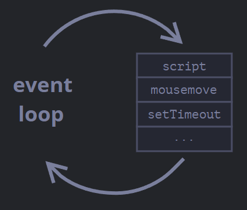

# Superlaw Prep

## Javascript

### 1) Event Loop & Async Model

Browser Javascript execution flow is based on *event-loop*.
Jargons!!! ~eh :(

Event-loop is simply nothing but an an endless loop. The concept is quite simple.
The JavaScript engine waits for tasks, executes them and then sleeps, all the while waiting for more tasks.

General Algorithm:
<pre>
1. While there are tasks:
       execute them, starting with the oldest task.
2. Sleep until a task appears, then go to 1.
</pre>

The JavaScript engine does nothing most of the time, it only runs if a script/handler/event activates (mousemove, setTimeOut, script, etc)

